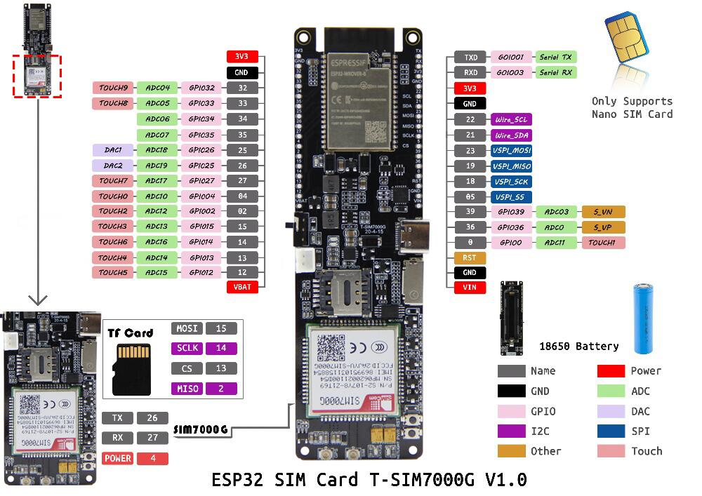
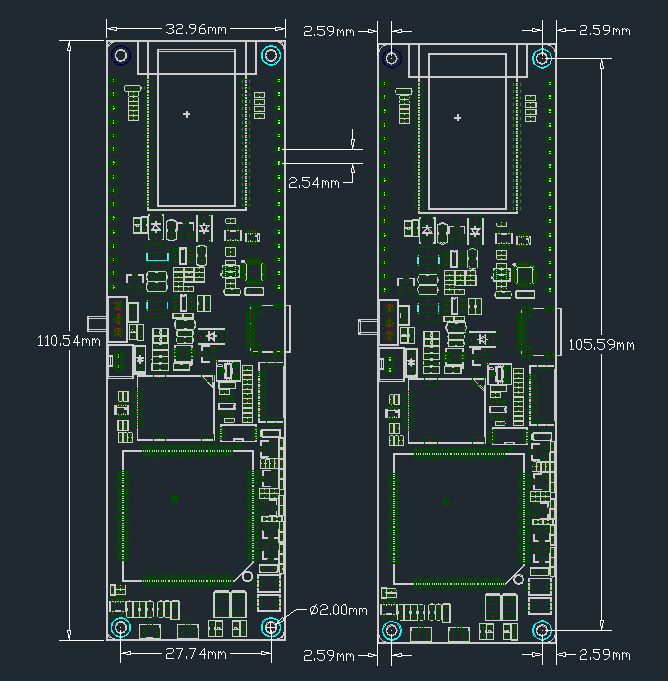

<h1 align = "center">LilyGO T-SIM7000G 20200415</h1>


### PinOut



### Dimensions



## Examples
- Arduino + TinyGSM library: [examples/Arduino_TinyGSM](../../examples/Arduino_TinyGSM/)
- Platformio_Arduino_Thingsboard :[/exaples/Platformio_Arduino_Thingsboard](../../examples/Platformio_Arduino_Thingsboard)
- Loboris Micropython: [/examples/MicroPython_LoBo](../../examples/MicroPython_LoBo)
- Arduino Cayenne: [/examples/Arduino_Cayenne](../../examples/Arduino_Cayenne)

## SIM7000G connection
| Name           | Pins  |
| -------------- | ----- |
| Modem DTR      | 25    |
| Modem Rx       | 26    |
| Modem Tx       | 27    |
| Modem PowerKey | 4     |
| Modem GPS      | GPIO4 |
| BAT ADC        | 35    |
| SOLAR ADC      | 36    |
| SD MISO        | 2     |
| SD MOSI        | 15    |
| SD CLK         | 14    |
| SD CS          | 13    |
| LED            | 12    |

**Modem GPS** is the internal GPIO of the SIM7000G module. When using GPS, GPIO4 needs to be set to high level, as shown below:

```
// Set SIM7000G GPIO4 HIGH ,Open GPS power
modem.sendAT("+SGPIO=0,4,1,1");

// Set SIM7000G GPIO4 LOW ,Close GPS power
modem.sendAT("+SGPIO=0,4,1,0");
```

- About the onboard indicator light description:
1. In the pin diagram, the red indicator light near the upper right of the switch is only on when the battery is connected, and it is always on when the USB is connected. It indicates that the battery is charging. If the battery is not connected, it may be Flashing
2. Below the red light is the green indicator light, which lights up only when the battery is fully charged, and it is always on when the battery is connected

3. Close to the side of the SIM7000G antenna is the status indicator. If the SIM7000G starts normally, it will always be on. If it does not start normally, it will not be on. It cannot be turned off by software.
4. Close to the status indicator is the network indicator, it indicates the network status, it can be closed by software
