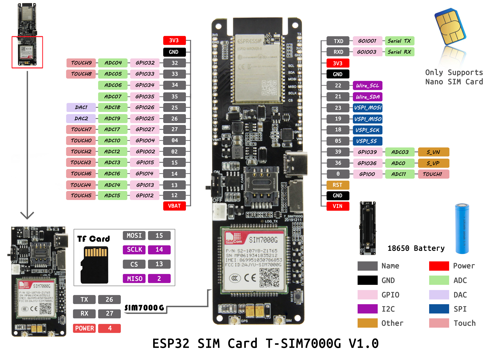
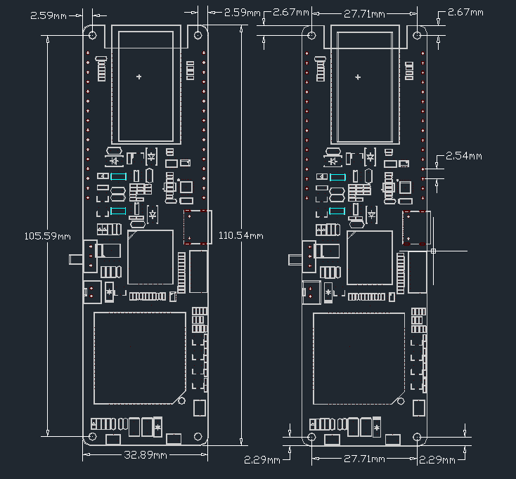

<h1 align = "center">LilyGO T-SIM7000G </h1>

### PinOut

### Dimensions

## Examples
- Arduino + TinyGSM library: [/examples/Arduino_TinyGSM](/examples/Arduino_TinyGSM)
- Arduino + SIM7000 library: [/examples/Arduino_sim7000](/examples/Arduino_sim7000)

## SIM7000G connection
| Name      | Pins |
| --------- | ---- |
| PIN_RX    | 26   |
| PIN_TX    | 27   |
| PWR_PIN   | 4    |
| BAT_ADC   | 35   |
| SOLAR_ADC | 36   |
| SD MISO   | 2    |
| SD MOSI   | 15   |
| SD CLK    | 14   |
| SD CS     | 13   |

