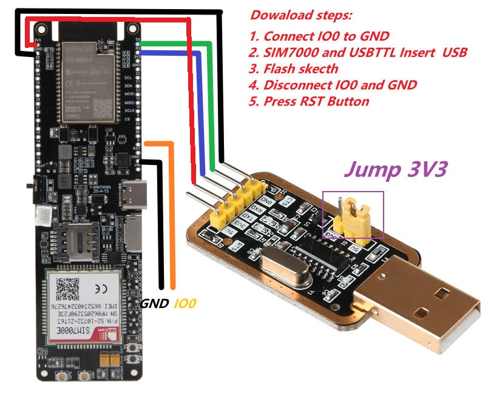

<h1 align = "center">LilyGo SIM7000G</h1>

Two main versions of the LilyGo SIM7000G have been released with the current board having better power management than the old board.


# News

* It is known that the firmware version 1529B08SIM7000G V01 has problems connecting to the MQTTS 8883 port. Please update the firmware version 1529B10SIM7000G
* Please see the [upgrade guide](./docs/How%20to%20update%20firmware.md)

```bash
-> AT+SIMCOMATI
<-  Revision:1529B08SIM7000G
    CSUB:V01
    APRev:1529B08SIM7000,V01
    QCN:MDM9206_TX3.0.SIM7000G_P1.03_20220415
    IMEI:xxxxxxxxxxxxx
```


### Version 20200415

   This board is an improvement of the original with fixes added that where recommended from feedback.
1. Added active GPS antenna power control, when the module GPIO4 is not turned on the antenna consumes only the static current of the LDO.
2. Replaced TP4056 with CN3065 for solar charge input management.
3. Added reverse battery protection
4. Added battery overcharge protection
5. Added battery over-discharge protection

 ### Version 20191227

   First board release,Sales have been stopped.

<h2 align = "left">Product 📷:</h2>

|                                Examples                                 |                                                                                                                       Product  Link                                                                                                                        |                    Schematic                     | Status |
| :---------------------------------------------------------------------: | :--------------------------------------------------------------------------------------------------------------------------------------------------------------------------------------------------------------------------------------------------------: | :----------------------------------------------: | :----: |
| [Version 20200415 (点击查看)](./Historical/SIM7000G_20200415/README.MD) | [Aliexpress](https://www.aliexpress.com/item/4000542688096.html)/[Amazon USA](https://www.amazon.com/dp/B099RQ7BSR?ref=myi_title_dp)/[FR](https://www.amazon.fr/dp/B099RQ7BSR?ref=myi_title_dp)/[DE](https://www.amazon.de/dp/B099RQ7BSR?ref=myi_title_dp) | [New Version](./schematic/SIM7000G_20200415.pdf) |   ✅    |
| [Version 20191227 (点击查看)](./Historical/SIM7000G_20191227/README.MD) |                                                                                                                          Obsolete                                                                                                                          | [Old Version](./schematic/SIM7000G_20191227.pdf) |   ❌    |

## Use reference

|   Product   |                             Youtube  link                             |                  explanation                    | Status | 
| :---------: | :-------------------------------------------------------------------: |:-----------------------------------------------:| :----: |
| T -SIM7000G | [Youtube link](https://www.youtube.com/watch?v=XlEUWIxdaNU) |    How to test whether LILYGO T-SIM7000G can register with the network     |   ✅    |
| LilyGo device | [Youtube link](https://www.youtube.com/watch?v=f3BybP3L7ls) |    How to enter boot mode to download the firmware     |   ✅    |

## Notes for new Users

0. SIM7000/SIM707G does not support 4G network. Please ensure that the USIM card you use supports 2G(GSM)/NB-IOT access,SIM7070 positioning and cellular cannot be used simultaneously. Please disconnect the network when positioning, and turn off GPS when connecting to the network

1. pin VIN is a USB input, if a battery is being used to power the device there will be no voltage output from VIN meaning 3.3v is the only power output.

2. When using the built-in battery pack the on/off switch will function as normal, supplying/cutting off power to the board, However, if an external battery pack is used and attached to the VBAT pin the on/off switch will be bypassed meaning the only way to shut off will be to disconnect the batteries.

3. On/off switch is for battery use only, it will not function when plugged into USB.

4. Battery voltage can not be read when plugged into USB using the onboard BAT ADC(35)

5. Recommended solar panels are 4.4v to 6v **DO NOT EXCEED OR BOARD MAY BE DAMAGED**

6. When an SD card in you can not upload software in Arduino IDE since the SD card uses IO2 as CS, the SD card must be removed when uploading a new sketch.

7. On Version 20200415, When using GPS the SIM7000G(GPIO4)/SIM7070G(GPIO5)(Physical pin number 48) needs to be set to HIGH to enable the antenna `modem.sendAT("+CGPIO=0,48,1,1");` once finished the pin can be set LOW `modem.sendAT("+CGPIO=0,48,1,0");` to prevent power leaking to the GPS antenna, This will make help battery life. If using USB or battery life is not a concern, it can be left HIGH.

8. If you are unable to access the network, please try <examples/Arduino_NetworkTest>, which will test the network connection. There are also binary files in the firmware directory, you can use the [Flash Download Tools](https://www.espressif.com/sites/default/files/tools/flash_download_tool_v3.8.5.zip) to download.

9.  How to change the connection method?
   - For example, the `Arduino_TinyGSM/AllFunctions.ino`  , you only need to change `modem.setNetworkMode(38);` to the corresponding number, and your network access speed depends on the carrier of the SIM card you use. Before using it, you can communicate with the operator of your SIM card.
   - The effect is as follows:
   

10. The initial network registration may be slow. Please be patient. You can configure the locked band as shown in the following figure.
   

11. How to update firmware?
   - [Upgrade guidelines ](docs/How%20to%20update%20firmware.md)

12. When the onboard USB bridge cannot be downloaded, you can use the external USB bridge to upload the sketch
   

13. Voltage range

| Battery Voltage requirements | Minimum | Maximum | Charging Current |
| ---------------------------- | ------- | ------- | ---------------- |
| SIM7000G                     | 3.5V    | 4.2V    | 500mA            |
| SIM7070G                     | 3.5V    | 4.2V    | 500mA            |

* It is recommended to use 18650 batteries with a capacity of more than 2500mA

| Solar Voltage requirements | Minimum | Maximum | Charging Current |
| -------------------------- | ------- | ------- | ---------------- |
| SIM7000G                   | 4.4V    | 6V      | 500mA            |
| SIM7070G                   | 4.4V    | 6V      | 500mA            |

> \[!TIP]
>
> It is recommended to use a solar panel with an output voltage of 6V or 5V and a power of about 5-10W. Solar energy can only charge the battery. Without the battery, the panel cannot supply power.
> Please note that this is only a suggestion. It is not necessary to use a 5-10W solar panel. 1W is also acceptable.
> The size of the solar panel determines the current and speed of solar charging. Please note that depending on the environment,
> the sunshine time may not exceed one hour per day. At this time, if the solar panel is too small and the light is not sufficient, it cannot be charged.


## GPIO MAP

| FUNCTION            | GPIO NUM |
| ------------------- | -------- |
| RX                  | 26       |
| TX                  | 27       |
| PWR                 | 4        |
| DTR                 | 25       |
| RING                | NC       |
| RESET               | NC        |
| ON BOARD LED(BLUE)  | 12       |
| SD SOCKET MISO      | 2        |
| SD SOCKET MOSI      | 15       |
| SD SOCKET SCK       | 14       |
| SD SOCKET CS        | 13       |
| BATTERY ADC CONNECT | 35       |
| SOLAR   ADC CONNECT | 36       |

## ON-BOARD LED

| FUNCTION            | COLOR                     |
| ------------------- | ------------------------- |
| MODEM STATUS        | RED   (Near the modem)    |
| MODEM NETWORK STATE | RED   (Near the modem)    |
| CHARGE FULL         | GREEN (Near the USB port) |
| CHARGING            | RED   (Near the USB port) |
| GPIO CONTROL        | BLUE                      |

### **MODEM STATUS**

- As long as the modem is turned on, the STATUS light will remain on and will go out when it is turned off.

### **MODEM NETWORK STATE**

| Network light status | Module working status                                                                                     |
| -------------------- | --------------------------------------------------------------------------------------------------------- |
| 64ms on/ 800ms off   | When not registered on the network                                                                        |
| 64ms on/ 3000ms off  | Already registered on the network (PS domain registration successful)                                     |
| 64ms on/ 300ms off   | During data transmission (PPP dial-up state and when using internal TCP/FTP/HTTP and other data services) |
| Off                  | Power off or PSM sleep mode                                                                               |
