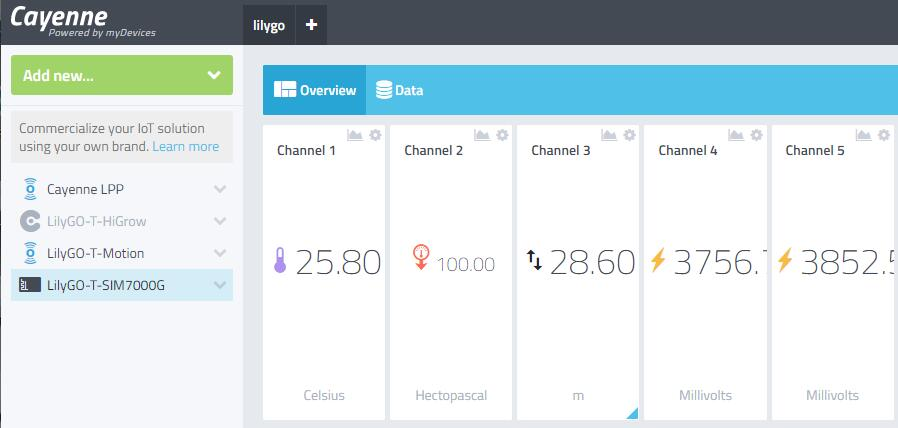

<h1 align = "center">LilyGO T-SIM7000 Cayenne</h1>

💦 ☀💨🌹 The sample code is based on the **[LilyGO T-SIM7000](https://www.aliexpress.com/item/4000542688096.html)** board, which takes the data of the external BMP180 sensor and uploads it to **[Cayenne](https://cayenne.mydevices.com/)**.

# Steps:
1. Need to install the following dependencies
     - [Adafruit BMP085 Library](https://github.com/adafruit/Adafruit-BMP085-Library)
     - [CayenneMQTT](https://github.com/myDevicesIoT/Cayenne-MQTT-Arduino)
     - [ArduinoJson](https://github.com/bblanchon/ArduinoJson) Use version 6.13.0
     - [TinyGSM](https://github.com/vshymanskyy/TinyGSM)
2. Set the Cayenne authentication info to match the authentication info from the Dashboard.If you don't have an account, then [create an account](https://accounts.mydevices.com/auth/realms/cayenne/login-actions/registration?client_id=cayenne-web-app&tab_id=01AaoLwmlng)
3. After logging in, you will see the dashboard, click **Add new** in the upper left,Choose **Generic ESP8266**,Then you can see the MQTT username, password and ID you need to use,Replace it with the definition in `main.cpp`
4. Set the network name and password.
5. Compile and upload the sketch.
6. A temporary widget will be automatically generated in the Cayenne Dashboard. To make the widget permanent click the plus sign on the widget.
7. By default, GSM is used to upload sensor data. You can also change it to ESP32 to upload. You only need to host the **USE_GSM** macro in the sketch.

