<h1 align = "center">T-PCIE-SIM7000 Blynk_Console</h1>

## **[English](./README.MD) | [中文](./README_CN.MD)**

# 步骤:

1. 需要安装下面的库
     - [Adafruit BMP085 Library](https://github.com/adafruit/Adafruit-BMP085-Library)
     - [blynk-library](https://github.com/blynkkk/blynk-library)
     - [TinyGSM](https://github.com/vshymanskyy/TinyGSM)

2. 注册登录[blynk.cloud](https://blynk.cloud/dashboard/login) 

3. 创建新模板或使用已有模板

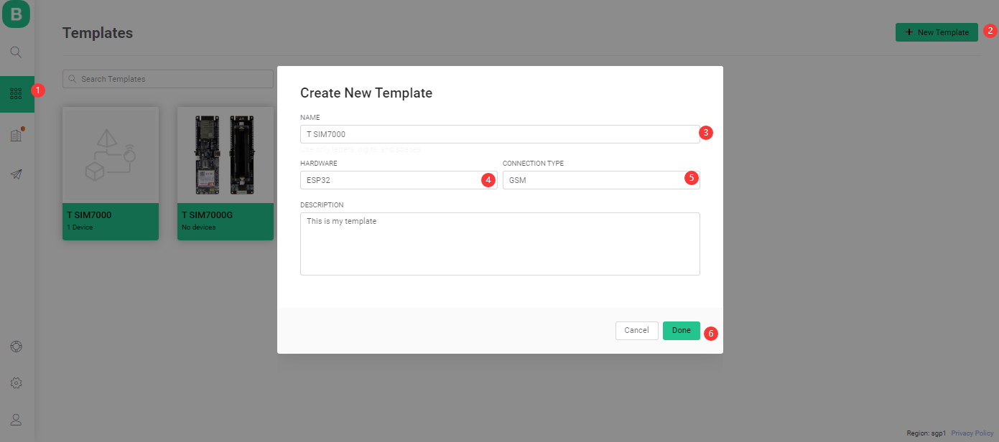

4. 当模板准备好，进入搜索->设备-创建新设备  

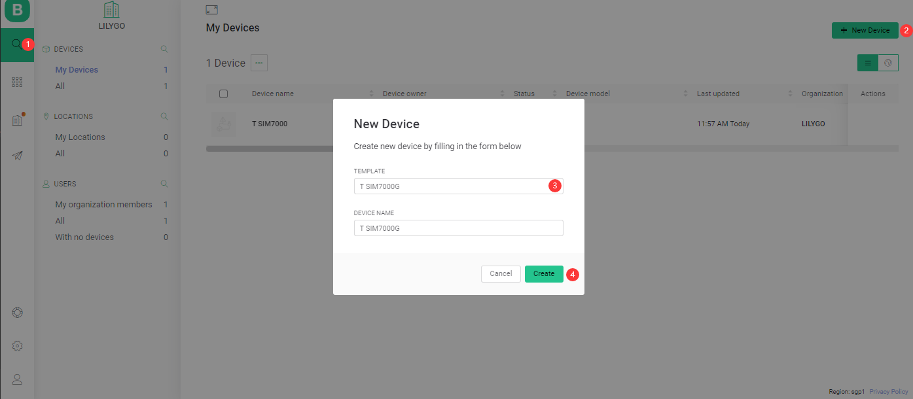

5. 配置模块

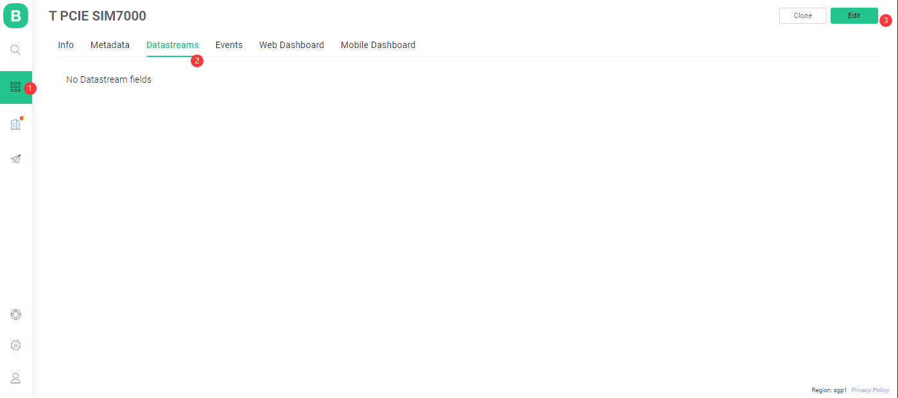
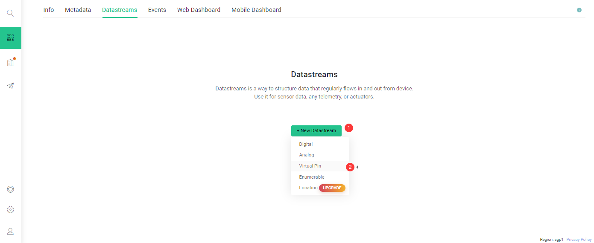
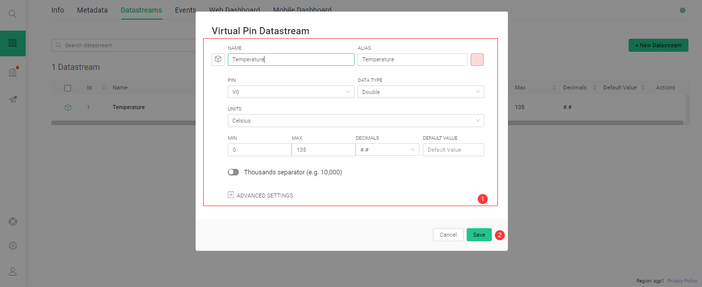
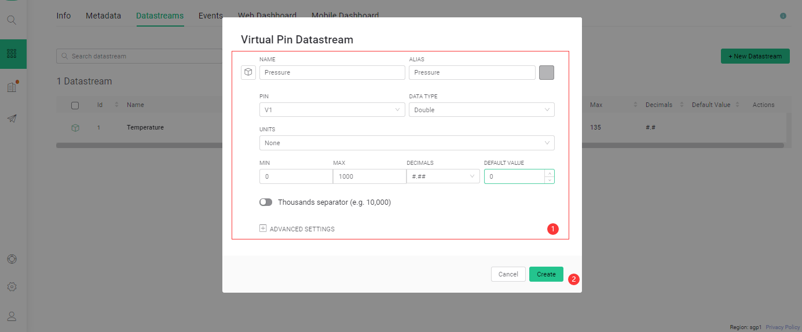
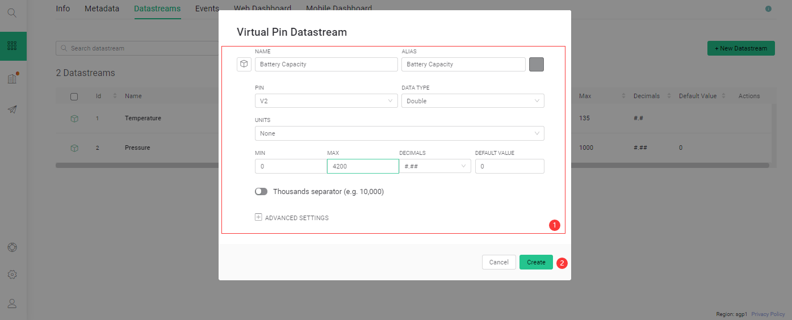
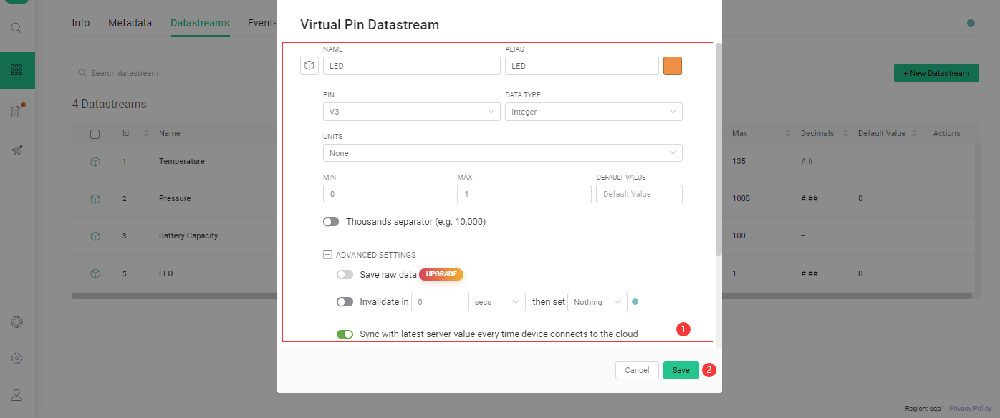

6. 设置 Web 仪表板 

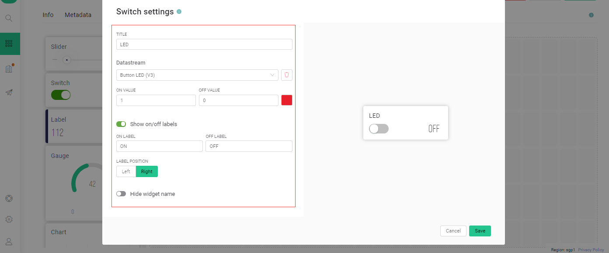
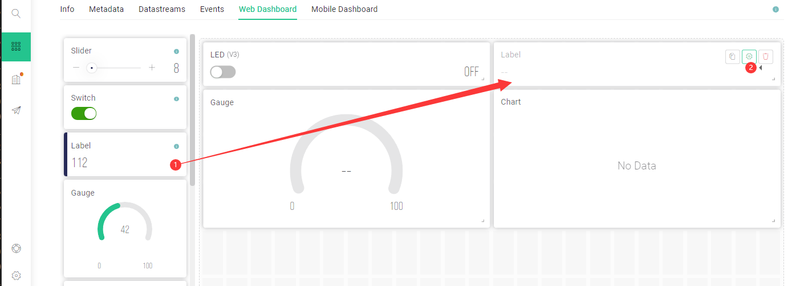
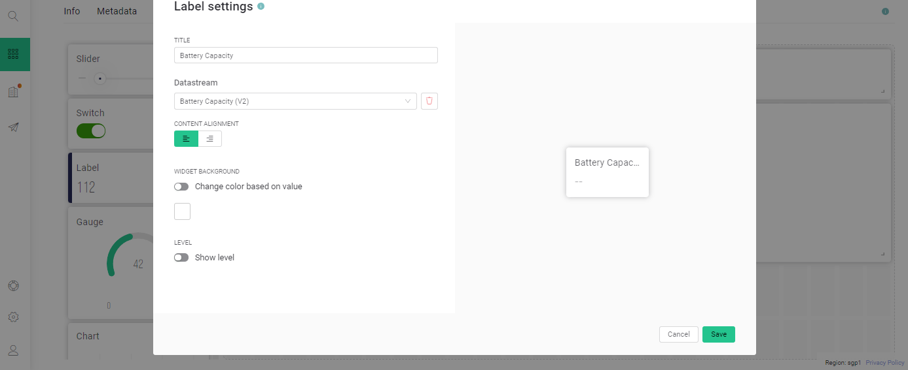
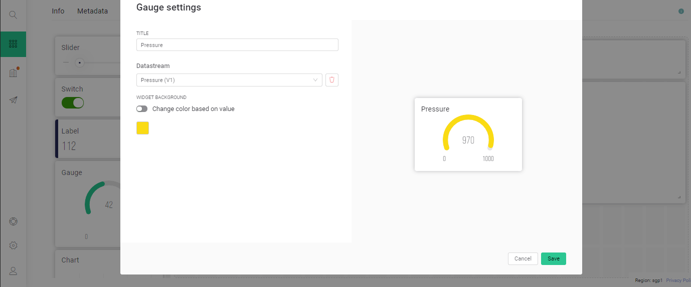
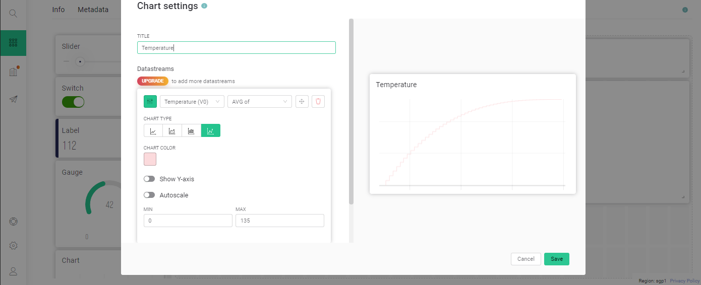
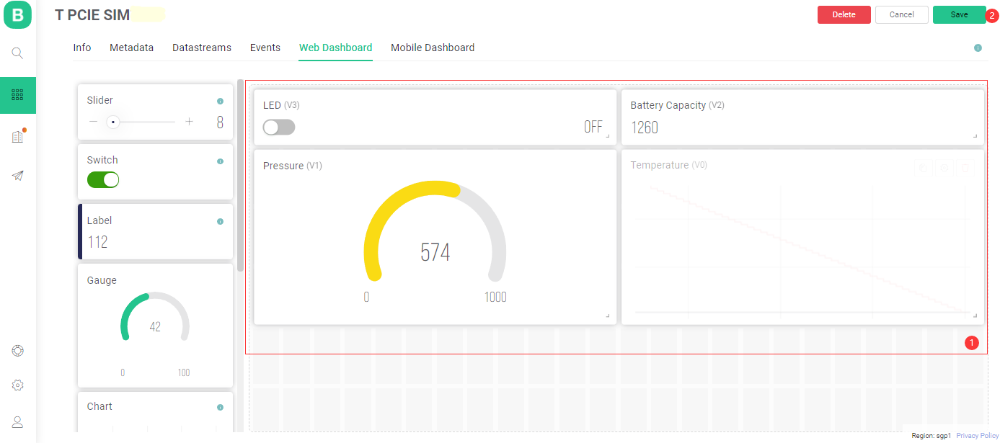

7. 替换代码中的宏

#define BLYNK_TEMPLATE_ID ""
#define BLYNK_DEVICE_NAME ""
#define BLYNK_AUTH_TOKEN "";

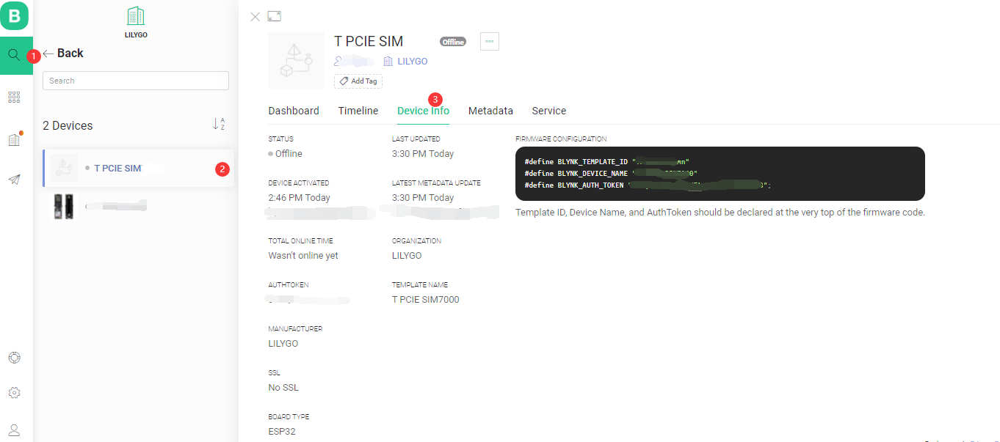

8. 上传代码，可以控制LDE和获取数据

 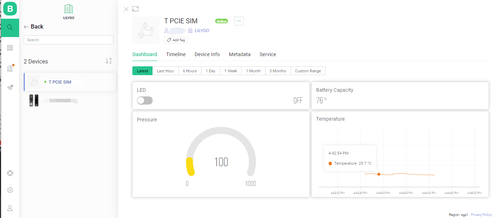

10. 参考[文档](https://docs.blynk.io/en/)

# 硬件接线
| T-PCIE pin  | BMP180 pin |
| ----------- | ---------- |
| 3.3         | VIN        |
| GND         | GND        |
| GPIO21(SDA) | SDA        |
| GPIO22(SCL) | SCL        |

