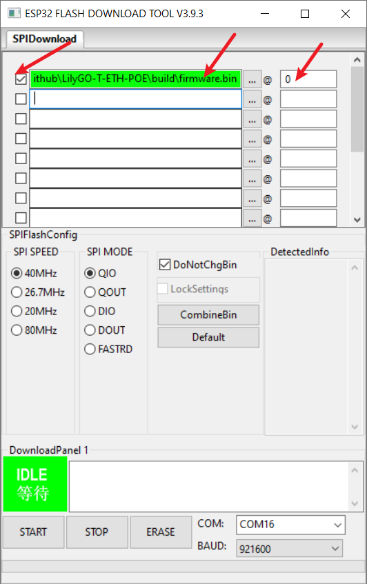

# Write to new users

- This page provides a quick diagnosis of whether the hardware is normal. The firmware in the example table below can provide a quick test of the hardware. Follow the writing method below.
- When using GPS positioning test, please do it outdoors or by extending the active GPS antenna. The geographical location cannot be obtained indoors.
- For network testing, please connect the LTE antenna to the board's silk screen MAIN or SIM IPEX antenna base.
- Please do not use a SIM card with a locked PIN code. Please delete the PIN code before use.

# 1️⃣ Quickly diagnose hardware

| GPS Test describe          | GPS Test Firmware                      | Network Test Firmware                          |
| -------------------------- | -------------------------------------- | ---------------------------------------------- |
| Firmware decoded NMEA data | [GPS_Decoder.bin](./GPS_Decoder.bin)   | [firmware](./Arduino_NetworkTest_Frimware.bin) |
| Firmware for raw NMEA data | [GPS_RAW_DATA.bin](./GPS_RAW_DATA.bin) | [firmware](./Arduino_NetworkTest_Frimware.bin) |

* [Firmware for raw NMEA data video](https://youtu.be/eVJ8NNOeWnY)

| Network Test describe                        | Network Test Firmware                          |
| -------------------------------------------- | ---------------------------------------------- |
| Firmware automatically searches for networks | [firmware](./Arduino_NetworkTest_Frimware.bin) |

[1]: https://www.lilygo.cc/products/t-sim7000g

## Use ESP Download Tool

| Steps  | [T-SIM70XX][1]                  |
| ------ | ------------------------------- |
| Step 1 |  |
| Step 2 |  |

## Use Web Flasher

[esp.huhn.me](https://esp.huhn.me/)

# 2️⃣FAQ

- Can't upload any sketch，Please enter the upload mode manually.
   1. Connect the board via the USB cable
   2. Press and hold the BOOT button , While still pressing the BOOT button (If there is no BOOT button, you need to use wires to connect GND and IO0 together.)
   3. Press RST button
   4. Release the RST button
   5. Release the BOOT button (If there is no BOOT button, disconnect IO0 from GND.)
   6. Upload sketch
